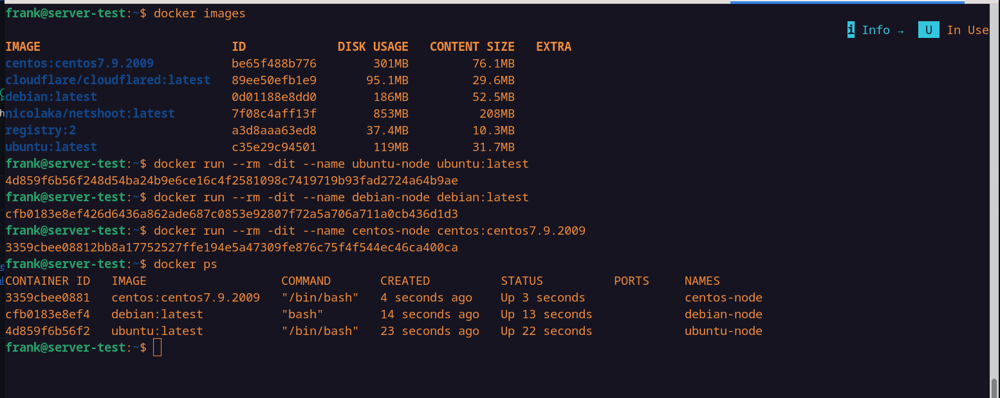
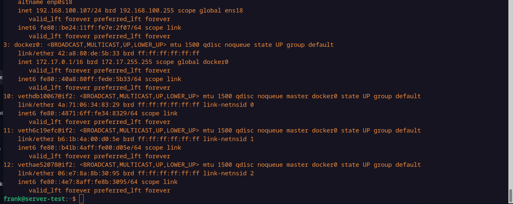
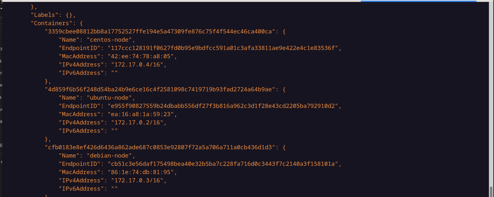
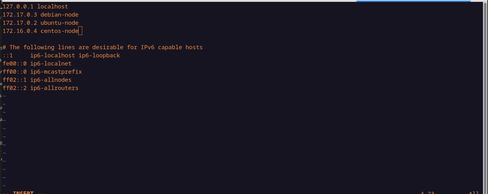
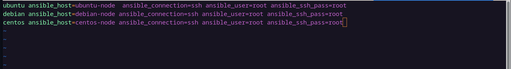
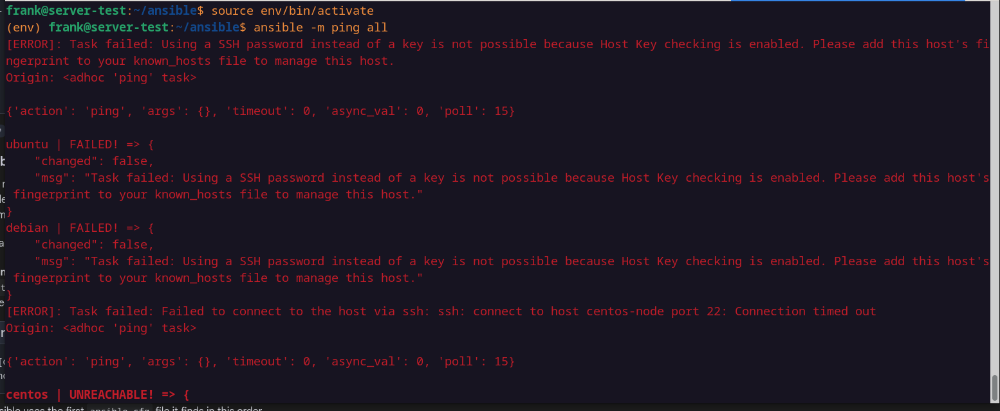
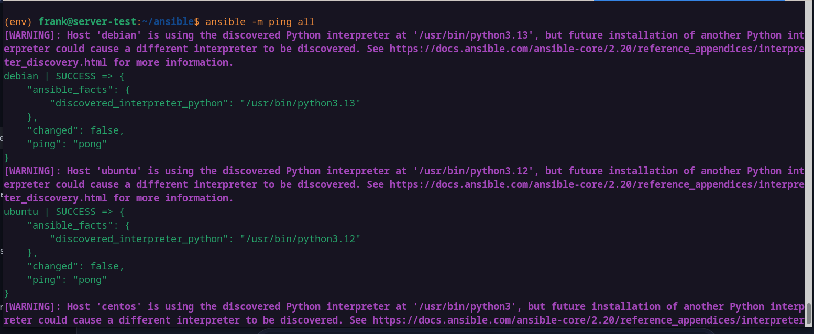

# ansible-sample
Ceci concerne l'installation d'ansible dans la méthode que je trouve la plus adaptée et permettre la commmunication entre le node-manager et les nodes.
NB: Je ne liste pas les commandes pour le workflow git parceque ce sont les commandes de bases utilisé en gestion de version (juste tenir compte du fait que chaque fois que l'on fait une action qui necessite une sauvegarde on versionne)
Pour quelqu'un qui n'a pas de vm une méthode adapté serait d'utiliser des conteneurs avec un peu de configuration sur ceux ci on pourra faire le test de communication.
1- Initialisation d'un vm et déploiement de trois conteneurs dessus
Je vais démarrer un serveur ubuntu sur ma machine y accéder via ssh pour l'ergonomie au niveau du terminal et crée trois conteneurs deux basés sur Ubuntu, un sur Centos et un sur Debian. Juste pour tester sur des environnements differents.
attention sur le choix du conteneux Centos. Préférer almalinux compatible RHEL plutot que Centos7 qui est en fin de vie moi j'ai du modifier le repertoire du gestionnaire de paquet et faire d'autre configs comme la génération des clés pour que ça fonctionne correctement.

2- j'installe open-ssh server dans les conteneurs et les autres paquets utiles (puisque par défaut il n'est pas installé)
`docker exec -it <container-id> shell` && `sudo apt update && apt install openssh-server`
Il est toujours aussi intéressant d'installer les outils de ping (iputils-ping) pour testes les communcations.
Pour le coups au lieu de créer d'autres utilisateurs dans le conteneur je donne un mot de passe au root (passwd)
Je lance le service ssh (service ssh start) accessoirement j'installe vim puisque c'est l'éditeur sur lequel  je suis à l'aise sous linux. nb: systemd n'est pas installé dans le conteneur normal c'est un environement minimaliste. C'est des petits éléments justement à connaitre pour tester avec des conteneurs.

3- Je vais vérifier le network bridge par défaut où j'ai lancé les conteneurs et récupérer leurs adresses ip pour modifier le fichier /etc/hosts de mon manager. Pour être sur on peut installer iproute2 et vérifier chaque conteneurs. 
C'est juste pour faciliter le nommage de nos conteneurs lorsque l'on veut lancer des commandes ou meme pour la config dans le fichier inventaire d'ansible)

4- J'installe ansible
j'installe ansible (sudo apt install ansible). Mais selon moi il est préférable de l'installe à partir de python dans un environnement virtuel ce qui peut faciliter la gestion des versions d'ansible qu'on pourrait vouloir utiliser donc on crèe un environnement virtuel, on le source et on installe ansible via pip comme tout autre paquet python)

5- Je crèe un fichier d'inventaire 
 - dans celui ci on va profiter pour tester des paramètres du fichier inventaire.ini (ansible_host, ansible_ssh_pass, ansible_connection, ansible_port) bien sur on ne versionne pas des paramètres comme ansible_ssh_pass si on doit héberger sur un dépot public. j'ai aussi directement crée un fichier .cfg dans lequel j'ai spécifier le fichier inventory pour pas avoir à le passer en mode adhoc.

 - on teste la connexion aux nodes en mode adhoc avec le module ping (ansible  -m ping all)
Ce test va échoué et justement le retour d'ansible est très parlant et signale que le problème est le paramètre host key cheking qui est activé empêche la communication. Il n'est évidemment pas recommandé de le désactiver pour des mesures de sécurité mais dans le cadre du test je vais le désactiver. `host_key_checking = False` dans le fichier de config.

- un deuxième essai echoue et la encore avec le retour de ansible on peut se rendre compte que c'est le fait de vouloir utiliser un password sur la connection ssh de manière interactive par défaut la connexion ssh ne le permet pas il faut donc installer le paquet sshpass.

- un troisième test fonctionne pour ubuntu et pour Debian nous stipule que python3 n'est pas trouvé.
 (justement ce test échoue sur le conteneur debian parceque par defaut dans ce conteneur python n'est pas installé. on va l'installer avec le module raw qui permet d'exécuter des commandes directement sur le système des nodes sans passer par python. Après une petite documentation de ce module, il faut noter que les modules tel que raw ou shell ne respectent pas vraiment l'un des principes sur lequel repose ansible qui est l'idempotence. en effet, ils doivent etre utilisés seulement en derniers recours pour ce fait. Donc on teste pour etre bien sur que l'élément principal pour le fonctionnement d'ansible soit ici python3 est bien présent et si ce n'est pas le cas, là seulement on utilise le module raw) je sais c'est une longue parenthèse.
 
 - installer python sur le node debian (ansible  -m raw -a "apt install -y python3" debian ) vu que nous somme en root on a pas forcément besoin de mettre le paramètre -k pour spécifier le mot de passe. 

 - lorsque l'on refait le ping on se rendra compte que le pong est là sur le serveur debian aussi.
D'où la preuve que ansible n'a besoin que de ssh et python pour fonctionner on a pas besoin d'installer un agent sur les nodes pour pouvoir jouer des playbooks. Des push vers les nodes suffisent pour que tout fonctionne. Les autres outils d'infrastructure As Code abordé dans le cursus CCNA comme puppet et chef justement ne permettent pas ça et il fonctionnent avec un agent.

